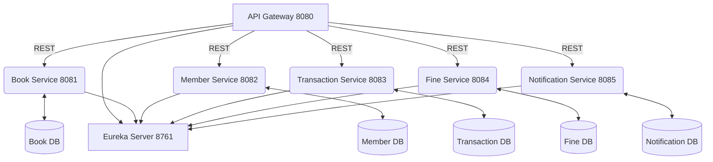

# Library Management System - Microservices Architecture

This is a comprehensive Library Management System built using Java Spring Boot with a microservices architecture. The system allows users to manage book collections, member registrations, book borrowing and return, and overdue tracking.

---

## Table of Contents
1. [Project Overview](#project-overview)
2. [Architecture Diagram](#architecture-diagram)
3. [Microservices & Responsibilities](#microservices--responsibilities)
4. [Database Schema & Entities](#database-schema--entities)
5. [API Endpoints](#api-endpoints)
6. [Setup Instructions](#setup-instructions)
7. [Configuration & Environment](#configuration--environment)
8. [Production-Ready Features](#production-ready-features)
9. [Inter-Service Communication](#inter-service-communication)
10. [Health Checks & Observability](#health-checks--observability)
11. [Error Handling & Validation](#error-handling--validation)
12. [Caching, Async, and Scheduled Tasks](#caching-async-and-scheduled-tasks)
13. [Email/Notification Flow](#emailnotification-flow)
14. [Deployment & Production Best Practices](#deployment--production-best-practices)
15. [API Documentation](#api-documentation)
16. [Contributing](#contributing)
17. [License](#license)

---

## Project Overview

- **Framework**: Spring Boot 3.2.0
- **Java Version**: JDK 21
- **Database**: MySQL 8.0
- **Service Discovery**: Netflix Eureka Server
- **API Gateway**: Spring Cloud Gateway
- **Inter-service Communication**: OpenFeign
- **ORM**: Spring Data JPA
- **API Documentation**: OpenAPI 3.0 (Swagger)
- **Caching**: Caffeine Cache
- **Email Service**: Spring Mail with Thymeleaf templates
- **Validation**: Bean Validation
- **Build Tool**: Maven

---

## Architecture Diagram



- **API Gateway**: Central entry point, routing, load balancing, security
- **Eureka Server**: Service discovery
- **Each Service**: Own DB, isolated domain logic
- **Inter-service**: REST (OpenFeign), async (future: events)

---

## Microservices & Responsibilities

| Service              | Port  | Responsibilities                                    |
|----------------------|-------|-----------------------------------------------------|
| API Gateway          | 8080  | Routing, security, Swagger aggregation              |
| Book Service         | 8081  | Book CRUD, search, inventory                        |
| Member Service       | 8082  | Member CRUD, status, profile                        |
| Transaction Service  | 8083  | Borrow/return, due/overdue, transaction history     |
| Fine Service         | 8084  | Fine calculation, payment, overdue tracking         |
| Notification Service | 8085  | Email/SMS, reminders, alerts, notification history  |
| Eureka Server        | 8761  | Service registry/discovery                          |

---

## Database Schema & Entities

### Book Service (`book_service_db`)
- **books**
  | id | title | author | genre | isbn | year_published | available_copies | total_copies |
  |----|-------|--------|-------|------|---------------|------------------|--------------|

### Member Service (`member_service_db`)
- **members**
  | id | name | email | phone | address | membership_status |
  |----|------|-------|-------|---------|------------------|

### Transaction Service (`transaction_service_db`)
- **borrowing_transactions**
  | id | member_id | book_id | borrow_date | due_date | return_date | status |
  |----|-----------|---------|------------|----------|-------------|--------|

### Fine Service (`fine_service_db`)
- **fines**
  | id | member_id | transaction_id | amount | status | issued_date | paid_date |
  |----|-----------|----------------|--------|--------|-------------|----------|

### Notification Service (`notification_service_db`)
- **notifications**
  | id | member_id | message | type | status | recipient_email | subject | created_at |
  |----|-----------|---------|------|--------|----------------|---------|------------|

---

## API Endpoints

### Through API Gateway (http://localhost:8080)

#### Book Management
- `GET /api/books` - Get all books
- `GET /api/books/{id}` - Get book by ID
- `GET /api/books/search?title=&author=&genre=` - Search books
- `POST /api/books` - Create new book
- `PUT /api/books/{id}` - Update book
- `DELETE /api/books/{id}` - Delete book

#### Member Management
- `GET /api/members` - Get all members
- `GET /api/members/{id}` - Get member by ID
- `POST /api/members` - Register new member
- `PUT /api/members/{id}` - Update member
- `PUT /api/members/{id}/status` - Update membership status

#### Transaction Management
- `GET /api/transactions` - Get all transactions
- `GET /api/transactions/member/{memberId}` - Get member's transactions
- `POST /api/transactions/borrow` - Borrow a book
- `PUT /api/transactions/{id}/return` - Return a book
- `GET /api/transactions/overdue` - Get overdue transactions

#### Fine Management
- `GET /api/fines` - Get all fines
- `GET /api/fines/member/{memberId}` - Get member's fines
- `POST /api/fines` - Create fine
- `PUT /api/fines/{id}/pay` - Pay fine

#### Notification Management
- `GET /api/notifications` - Get all notifications
- `GET /api/notifications/{id}` - Get notification by ID
- `GET /api/notifications/member/{memberId}` - Get member's notifications
- `POST /api/notifications` - Create notification
- `POST /api/notifications/due-reminder` - Create due reminder
- `POST /api/notifications/overdue-alert` - Create overdue alert
- `POST /api/notifications/fine-notice` - Create fine notice
- `GET /api/notifications/stats` - Get notification statistics

#### Example: Get Book by ID
```http
GET /api/books/1
Response: 200 OK
{
  "id": 1,
  "title": "The White Tiger",
  "author": "Aravind Adiga",
  "genre": "Fiction",
  "isbn": "978-1-4165-6259-7",
  "year_published": 2008,
  "available_copies": 5,
  "total_copies": 5
}
```

---

## Setup Instructions

### Prerequisites
- Java 21 or higher
- Maven 3.9+
- MySQL 8.0+
- SMTP Server configuration (for email notifications)

### Database Setup
```bash
# Run the SQL scripts to create databases and tables
mysql -u root -p < scripts/01-create-databases.sql
mysql -u root -p < scripts/02-seed-data.sql
```

### Start Eureka Server
- Download and start Netflix Eureka Server on port 8761
- Or use Spring Cloud Eureka Server starter

### Configure Database Connection
- Update database credentials in each service's `application.yml`
- Default: username=root, password=root

### Start Services
```bash
# Start services in this order
cd eureka-server && mvn spring-boot:run
cd api-gateway && mvn spring-boot:run
cd book-service && mvn spring-boot:run  
cd member-service && mvn spring-boot:run
cd transaction-service && mvn spring-boot:run
cd fine-service && mvn spring-boot:run
cd notification-service && mvn spring-boot:run
```

### Configure Email Settings (Optional)
- Update notification-service application.yml with your SMTP settings
- Set environment variables: MAIL_USERNAME and MAIL_PASSWORD

### Automated Startup
- Use `scripts/start-services.sh` to initialize DB, start all services, and check health.

---

## Configuration & Environment

- **Database**: Set DB credentials in each service's `application.yml`
- **Email**: Set `MAIL_USERNAME` and `MAIL_PASSWORD` as env vars for notification-service
- **Ports**: Each service runs on a fixed port (see above)
- **Profiles**: Use `dev`, `prod` profiles for environment-specific config
- **Startup**: Use `scripts/start-services.sh` for full stack startup (see logs/ for output)

---

## Production-Ready Features

- **Service Discovery**: Netflix Eureka
- **API Gateway**: Spring Cloud Gateway (rate limiting, CORS, security headers)
- **Database**: MySQL 8.0, connection pooling, separate DB per service
- **ORM**: Spring Data JPA, schema auto-migration
- **Caching**: Caffeine (in-memory)
- **Async Processing**: @Async, scheduled jobs for reminders
- **Email**: Spring Mail + Thymeleaf, SMTP config via env vars
- **Validation**: Bean Validation (JSR-380)
- **API Docs**: OpenAPI 3.0 (Swagger UI per service)
- **Monitoring**: Spring Boot Actuator, `/actuator/health`, `/actuator/info`
- **Logging**: Structured logs, correlation IDs, logback config
- **Error Handling**: Global exception handler, consistent error responses
- **Security**: CORS, security headers, (future: JWT auth)
- **Config Management**: Externalized via `application.yml`, profiles, env vars
- **Observability**: Health, metrics, logs, future: distributed tracing

---

## Inter-Service Communication

- **Synchronous**: REST via OpenFeign clients
- **Service Discovery**: Eureka registry
- **Load Balancing**: Ribbon (client-side)
- **Error Handling**: Circuit breaker (future: Resilience4j)
- **Async**: Scheduled jobs for reminders, future: event-driven (Kafka/RabbitMQ)

---

## Health Checks & Observability

- **Actuator Endpoints**: `/actuator/health`, `/actuator/info`, `/actuator/metrics`
- **Service Health**: Checked by startup script and via Eureka
- **Logging**: All logs in `logs/` directory, per-service log files
- **Monitoring**: Ready for integration with ELK, Prometheus, Grafana

---

## Error Handling & Validation

- **Global Exception Handler**: Consistent error format
- **Validation**: Request body/params validated, errors returned as 400
- **Sample Error Response**:
```json
{
  "timestamp": "2025-06-18T12:00:00Z",
  "status": 400,
  "error": "Bad Request",
  "message": "Validation failed: title must not be blank",
  "path": "/api/books"
}
```

---

## Caching, Async, and Scheduled Tasks

- **Caching**: Caffeine for book/member lookups
- **Async**: Notification sending, scheduled reminders
- **Scheduled**: Overdue checks, fine calculation, daily reminders

---

## Email/Notification Flow

- **Templates**: HTML via Thymeleaf (`notification-service/resources/templates/`)
- **Types**: Welcome, due reminder, overdue alert, fine notice
- **Retry**: Failed notifications retried with exponential backoff
- **Stats**: `/api/notifications/stats` for analytics

---

## Deployment & Production Best Practices

- **Build**: Maven, multi-module
- **Run**: `scripts/start-services.sh` (handles DB, logs, health checks)
- **Logs**: Per-service, rotate and monitor
- **Security**: Use strong DB/email passwords, restrict ports, enable HTTPS in prod
- **Scaling**: Each service can be scaled independently
- **Future**: Docker/K8s, CI/CD, JWT auth, distributed tracing

---

## API Documentation

Each service provides comprehensive API documentation using OpenAPI 3.0 (Swagger):

- **API Gateway Swagger UI**: http://localhost:8080/swagger-ui.html
- **Book Service**: http://localhost:8081/swagger-ui.html
- **Member Service**: http://localhost:8082/swagger-ui.html
- **Transaction Service**: http://localhost:8083/swagger-ui.html
- **Fine Service**: http://localhost:8084/swagger-ui.html
- **Notification Service**: http://localhost:8085/swagger-ui.html

---

## Contributing

1. Fork the repository
2. Create a feature branch
3. Commit your changes
4. Push to the branch
5. Create a Pull Request

---

## License

This open-source project is available under the [MIT License](LICENSE).
